

 <h2>User Guide</h2> 

​		Playing with different electronic components and creating your own circuits online! If you have a question or would like to recommend a feature, please reach out to [contact@opencircuits.io](mailto:contact@opencircuits.io).

 <h2>Getting Started with Open Circuits</h2> 

​		Welcome to Open Circuits. Let's first get familar with the user interface.

  Help center for more resources                          Download circuits in *.circuit, *.pdf, or *png file.

  Import *.circuit files from computer                Sign in using google account.

  Save your circuit after you sign in                  Edit mode                         Lock mode

  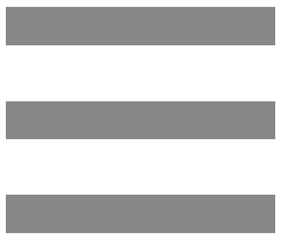   Manage circuits and view examples.   	           Github link      			      Add components

​		Great! Let's get to know our first circuit! Clicking the  button and then the Basic AND Gate Setup to load the example circuit. If it's not shown, refresh the page and try again.  

 <h5>Example Circuit</h5> 
																											 					

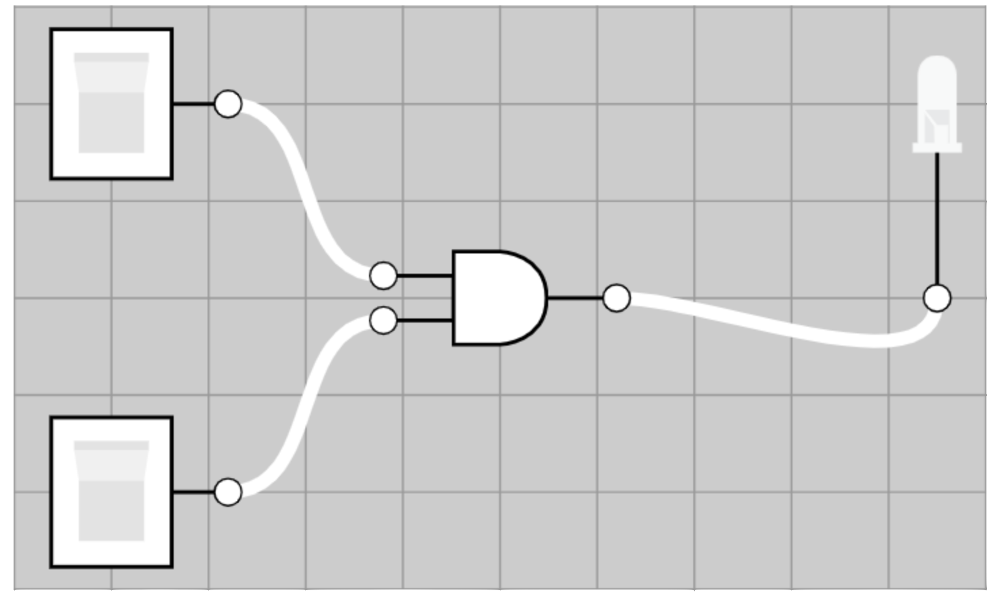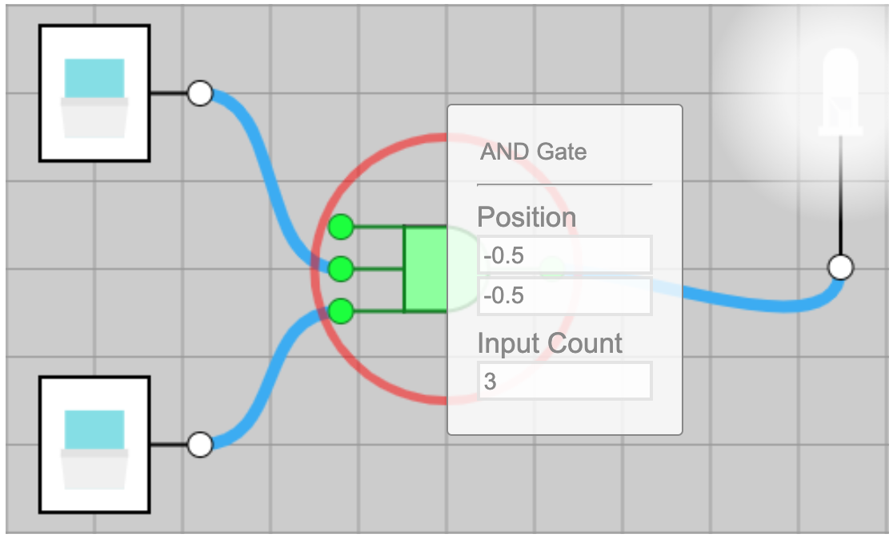

​		

​		**Basic**: This example contains two switches, one AND Gate , and one LED 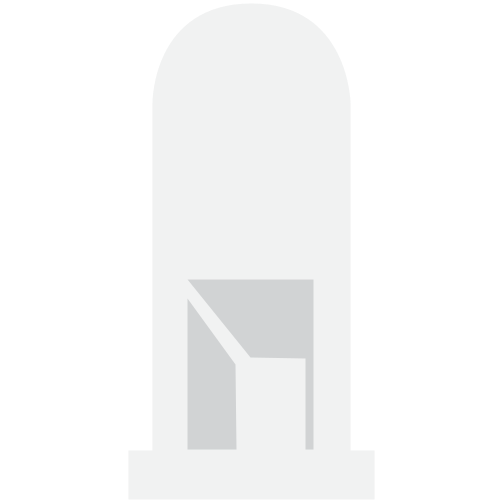. Switch, aside from its original function, also represents signal. AND Gate passes the signal only if all switches are on, that means all inputs are true. Currently, there're two. Turn up both of them to light up the LED.
​		**How to edit**: That's lit! Click the AND Gate  and it will show a list of parameters. Below it's a table for the all parameters we support currently. Change whichever you want.

| Pararmeter  |                       Description                       |
| :---------: | :-----------------------------------------------------: |
|    Name     |          Name of the component, including wire          |
|  Position   |                Position of the component                |
| Input count | Maximum input count are varied by different components. |
|    Color    |                    Color of the LED                     |
|  Create IC  |      Creating an integrated circuit in the scene.       |
| Clock Delay |       How often the Clock turn on/off the signal.       |

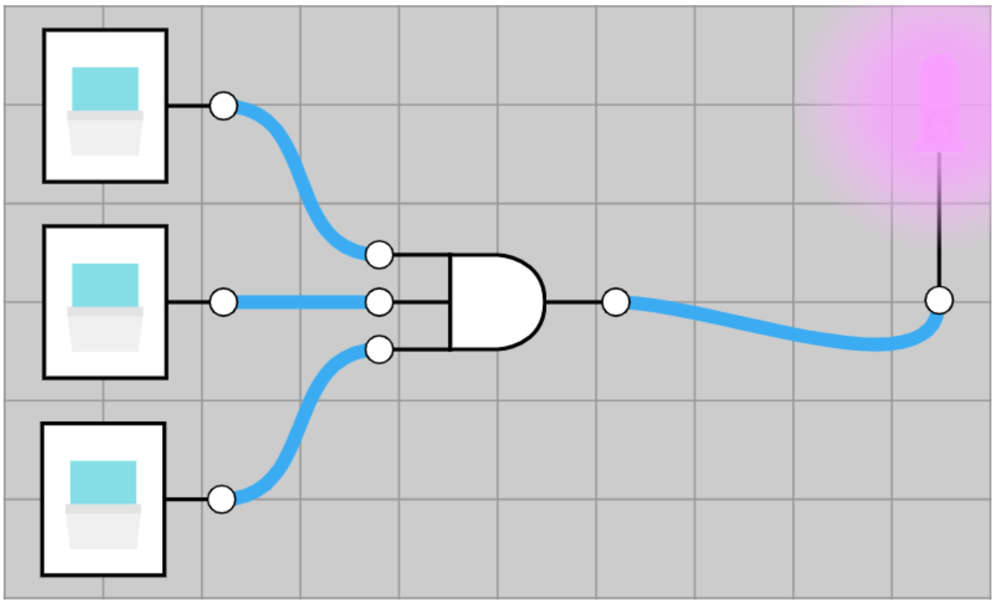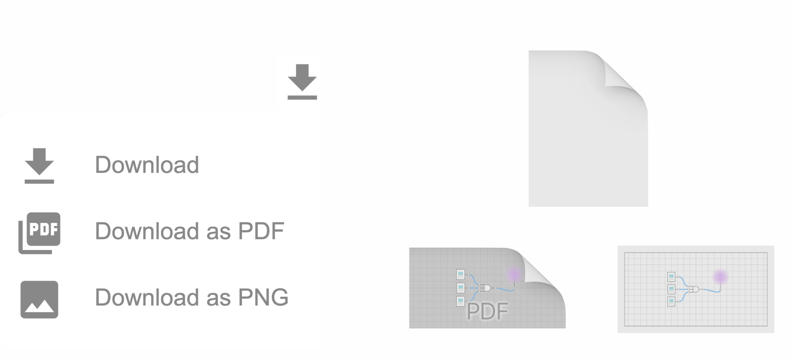		

​

​		**Add components**: I change input count to three and color to pink. Notice there's one more button here. How? You could just click the add icon   , drag the switch icon tdowo the circuit, and connect it to the new input of the AND Gate .
​		**Save the circuit locally**: Clicking thebutton. You will see three options:
​	  Download: save as [name].circuit file. Notice that this is the only supported file for import.
​	    Download as PDF				      		   Download as PNG

​		**Save the circuit online**: Clicking the  button and sign in with your google account and then the  button to save the circuit online. You could always remove it from the cloud by clicking the  and buttons under "My Circuits" section.

 <h2>Supported Components</h2> 

 <h5>Inputs</h5> 

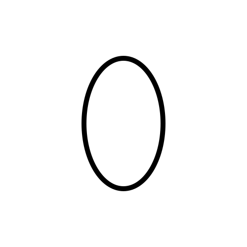**Constant Low**: signal that is constantly off.**Constant High**: signal that is constantly on.

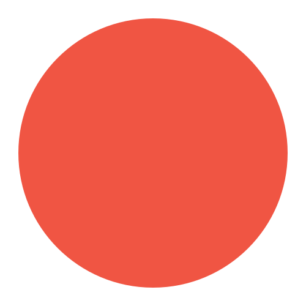**Button**: Left click to enable signal one time.**Switch**: Left click to switch on/off signal .

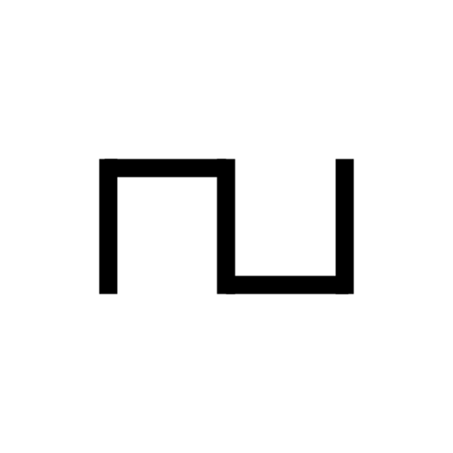**Clock**: Auto-switch on/off signal regularly by setting the clock delay.

 <h5>Outputs</h5> 

**LED**: Light up if it connects to the signal.    **Segment Display**: Display digits.

 <h5>Logic Gates</h5> 

**Buffer Gate**: It passes its input, unchanged, to its output.

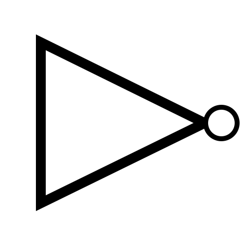**NOT Gate**: It produces an inverted version of the input at its output.

**AND Gate**: It implements logical conjunction (∧) from mathematical logic.

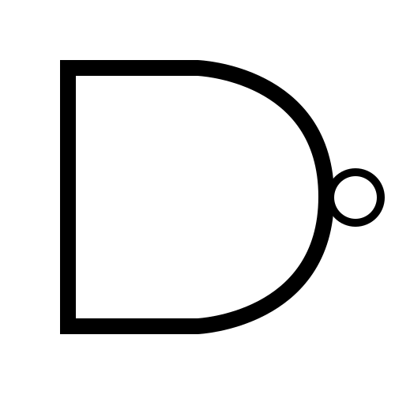**NAND Gate**: It produces an output which is false only if all its inputs are true.

**OR Gate**: It implements logical disjunction (∨) from mathematical logic.

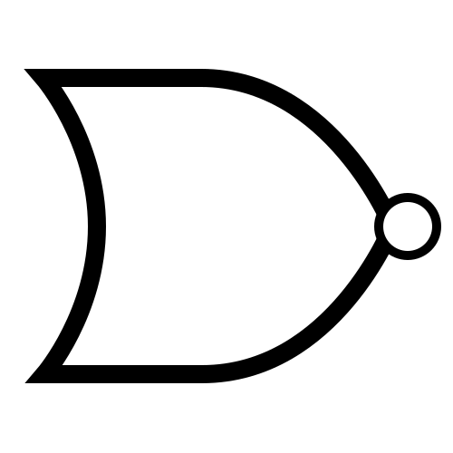**NOR Gate**: It gives a positive output only when both inputs are negative.

**XOR Gate**: It gives a true output when the number of true inputs is odd.

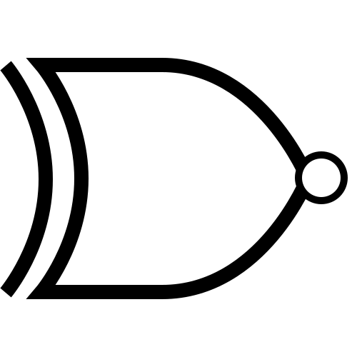**XNOR Gate**: It gives true when all of its inputs are true or when all of its inputs are false

 <h5>Flip Flops</h5> 

 **SR Flip Flops**: a 1-bit memory bistable device having two inputs.

 **JK Flip Flops**: it has the input- following character of the clocked D flip-flop but has two inputs.

 **D Flip Flops**:  delay the change of state of its output signal.

 **T Flip Flops**:  is toggled when the set and reset inputs alternatively changed by the trigger.

 <h5>Latches</h5> 

 **D Latches**: capture the logic level which is present on the Data line when the clock input is high.

 **SR Latches**: a special type of asynchronous device which works separately for control signals.

 <h5>Other</h5> 

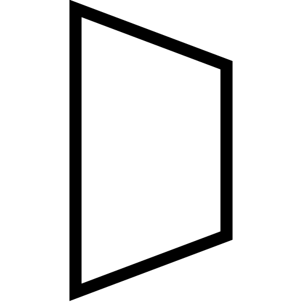**Multiplexer(Mux)**: It's a device that can receive multiple input signals and synthesize a single output signal in a recoverable manner for each input signal.

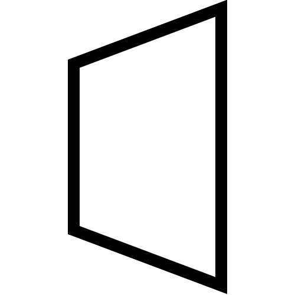**Demultiplexer(Demux)**: It takes one single input data line and then switches it to any one of a number of individual output lines one at a time.

**Encoder**: It converts the active data signal into a coded message format or it is a device that coverts analogue signal to digital signals

**Decoder**: It's a combinational circuit as encoder but its operation is exactly reverse as that of the encoder

**Label**: a text box that allows you to write any text inside.

 <h2>Keyboard Shortcuts</h2> 

**Undo**: ctrl + z		**Redo**: ctrl + y		**Copy**: ctrl + c		**Paste**: ctrl + v		**Cut**: ctrl + x
**Select**: left click the component		 **Multiple select**: hold left click
**Delete a component**: Press “delete”								 **Zoom in/out**: scroll the middle wheel

 

 

 

 

 

 

