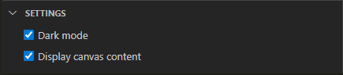
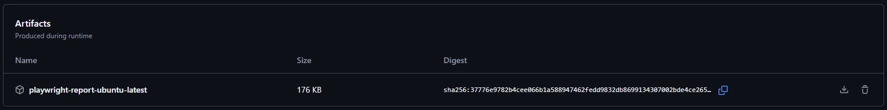

Playwright is an end-to-end testing framework that allows us to write tests that represent how the site is actually used. This allows for broader testing than our unit tests.

---

## Basic Operation

To run the tests, you can use the commands
```bash
yarn test-e2e:digital
yarn test-e2e:landing
```
to execute the tests for the digital site and the landing site, respectively.

Alternatively, you can run
```bash
npx playwright test
```
to run the tests using whichever config is loaded into `playwright.config.ts`, which is the digital site by default. This approach is not recommended.

Options such as `--ui` can be passed into those yarn wrapper commands, and the syntax would simply look like
```bash
yarn test-e2e:digital --ui
```

The test will automatically start up the dev server on port 3000. If you are already running the site locally on that port, it will reuse that instance instead.

---

## Project and Test Folder Structure

There are 5 different browsers that our Playwright tests can target:
1. `chromium` (which powers Google Chrome)
2. `webkit` (which powers Safari)
3. `firefox`
4. `Mobile Chrome` (also referred to as `android`)
5. `Mobile Safari` (also referred to as `iphone`)

Playwright test files use the `.spec.ts` file extension, and can be found in the subdirectories of the `playwright` directory. The general subdirectory structure is `./playwright/{site}/{browserCategory}/{browserName}/{testFile}.spec.ts`. `{site}` can be `digital` or `landing` and `{browserCategory}` can be `desktop`, `mobile`, or `shared`.

- If `{browserCategory}` is `desktop`, then `{browserName}` can be `chromium`, `webkit`, `firefox`, or `shared`.
- If `{browserCategory}` is `mobile`, then `{browserName}` can be `android`, `iphone`, or `shared`.
- If `{browserCategory}` is `shared`, then there will be no `{browserName}` subdirectory.

A test in a `shared` folder will run for all the relevant browsers. For example, `./playwright/digital/desktop/shared/basicCircuit.spec.ts` will run for `chromium`, `webkit`, and `firefox`. `./playwright/landing/shared/basicLanding.spec.ts` will run for all 5 browsers.

---

## Running Tests Under Prod Site

To run the tests under the version of the site compiled for prod, use
```bash
yarn test-e2e:ci
```
This is how the tests are run in the GitHub action on pull requests.

:::note

Currently only digital has a "prod" version, so landing still uses the dev version.

:::

---

## Helpful Commands

### Codegen
```bash
npx playwright codegen
```
For usage instructions, see the [official docs](https://playwright.dev/docs/codegen).

### Test Runner UI
```bash
yarn test-e2e:digital --ui
```
You can replace `test-e2e:digital` with any of the other test-e2e commands (including `test-e2e:ci`) to run with the UI enabled. To see canvas contents in the UI, open the settings dropdown in the bottom left of the UI and check the "Display canvas content" option:


For more UI usage explanation, see the [official docs](https://playwright.dev/docs/test-ui-mode).

## Viewing a Failed Test from GitHub Actions

If the Playwright tests fail in GitHub Actions, you can download and view the logs locally. In the run's "Summary" section there will be an Artifacts section:


Click "playwright-report-ubuntu-latest" to download the report. Unzip that and move the contents (`index.html` and the `data` and `trace` folders) into the `playwright-report` folder of this repo, replacing what is already there. Then run `npx playwright show-report` to view the report.
