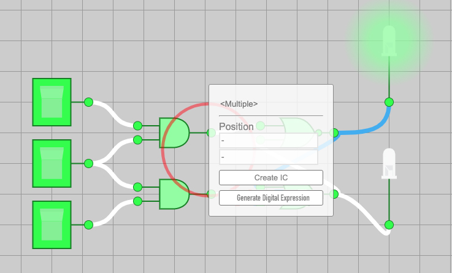
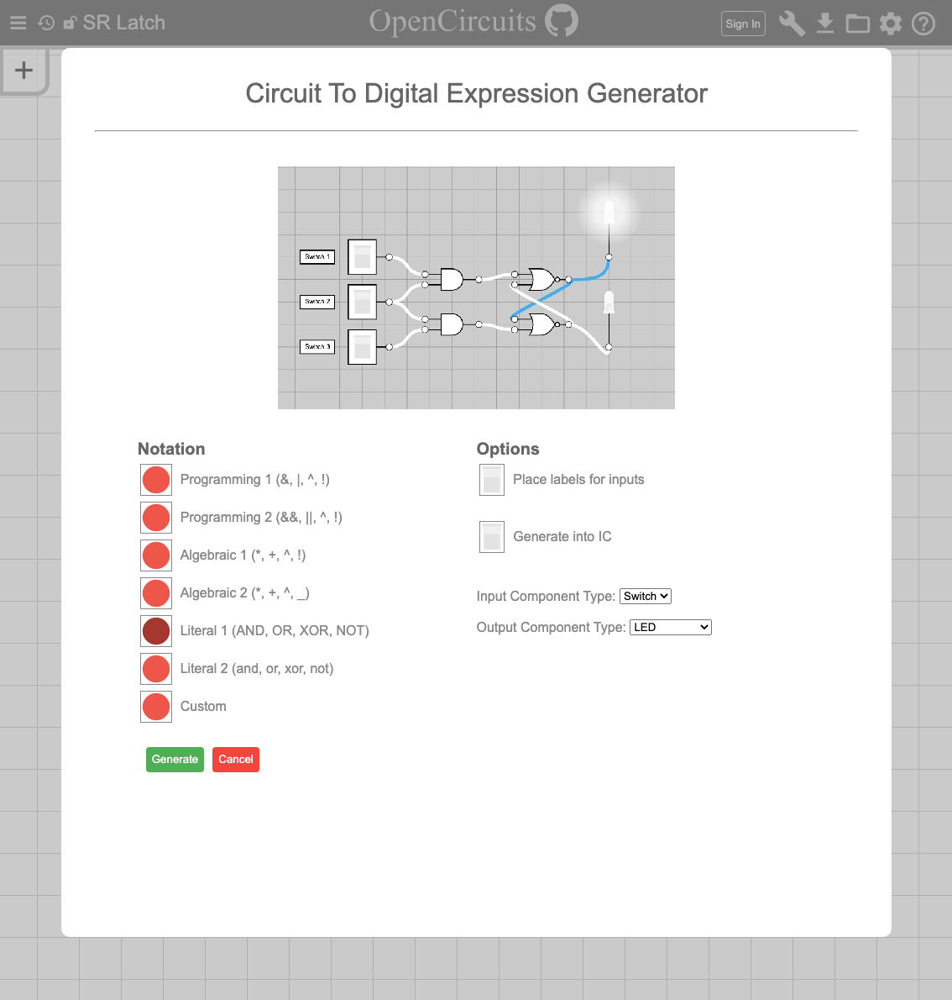
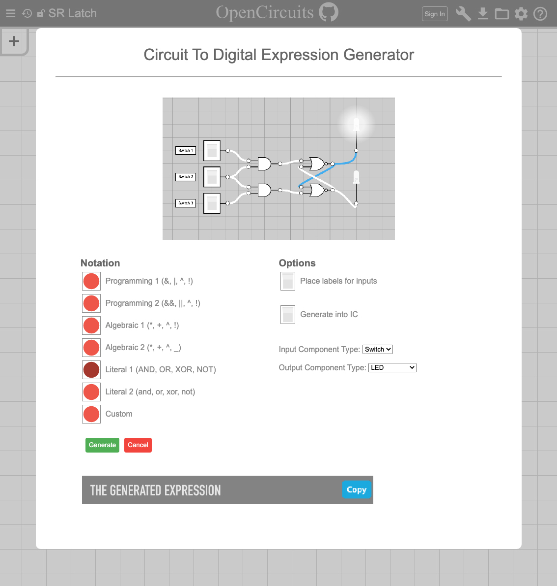

import TOCInline from '@theme/TOCInline';
import Timeline from './_timeline';

---

# *Circuit to Logical Expression* Design Doc
#### *[Trevor Crystal](https://github.com/TGCrystal)*, *[Leon Montealegre](https://github.com/LeonMontealegre)* (Last updated *June 19, 2022*)

    

        Table of Contents
    

    <TOCInline toc={toc} />

## Overview

Recently, a feature to generate a circuit from a logical boolean expression was added. This is an interesting feature and can be useful for those learning how the logic of digital circuitry works. There is, however, no way to do the reverse of this operation.

## Context

Being able to see the expression that represents a selected circuit would be a useful and educational feature to have.

## Goals & Non-Goals

### Goals:
- Allows users to see the expression of a circuit with AND, OR, XOR, or NOT gates (or their inverted variations)
- Allows users to see the expression of a circuit described above that is inside of an IC

### Non-Goals:
- We do not plan on implementing this feature with components like multiplexers, latches, entire ICs, etc.

## Milestones

<Timeline 
    start="" 
    milestones={[{
        date: "",
        explanation: "Add the additional required functionality in the current tree structure and merge",
    }, {
        date: "",
        explanation: "Create and test functions for all intermediary steps",
    }, {
        date: "",
        explanation: "Create and test combined action (or function) and ui",
    }]} 
    end="" />

## Existing Solution

The user must manually figure out the expression that a circuit represents.

## Proposed Solution

Proposed User Walk-Through:

1. The users selects a valid circuit (including inputs and output)
2. The selection popup somehow indicates or allows an indication for the expression

## Alternative Solutions

None to consider

## Testability

The steps of circuit->tree, tree->tokens, and tokens->expression can all be tested independently. The entire process can be wrapped in a testable action.

## Impact

The expression to circuit data structures should be modified to better represent a wider variety of circuits. Namely, the two main changes would be allowing variable number of input gates and representing negated gates.

Representing a variable number of input gates for OR, NAND, and XNOR operations (and their negated versions) would allow for improved parsing in both directions. 

Simplifying `NOT+AND->NAND` alredy happens as an action one the entire circuit is generated. To best represent circuits when going from circuit to expression, it would be easier to just represent this at the abstract level.

There is one more case that we would not easily be able to represent at the abstract level. Whenever one component (other than an input) outputs to multiple different components, there is currently no simple representation we can modify. This wouldn't be a problem for circuit to expression, but it would mean that circuit to expression and expression to circuit are not perfect opposite actions of eachother.

## Known Unknowns

- ~~The exact way the expression is represented in the Selection Popup is unknown. It could have a button that would directly display it, or, if the algorithm is efficient enough, can display the expression inline. That would mean there (probably) couldn't be any choices for how to format the output.~~ The output will be shown in a popup along with settings, similar to the Expression to Circuit Popup.
- ~~Should there be options to format the output (different operations, parenthesis usage, etc.)?~~ Yes
- ~~Should all operations be parenthesized (easy and literal) or should the parenthesis be removed if not necessary (hard and simplified)?~~ Option for it, simplify by default.
- ~~The output can be confusing with unnamed inputs. Is there any way to remedy this?~~ Ex: 2 Switches both named Switch, in the output they will be named "Switch1" and "Switch2". In the popup, after Generate is clicked, it can show labels (in the popup view only) for the names for the components.

## Detailed Scoping

### Milestone 1

1. The `InputTreeUnOpNode` and `InputTreeBinOpNode` interfaces can both include a `negated: boolean` property.
2. The `lChild` and `rChild` properties of `InputTreeBinOpNode` can be replaced by a tuple like `children: [InputTree, InputTree, InputTree?, InputTree?, InputTree?, InputTree?, InputTree?, InputTree?]` (not sure if there is a cleaner way to do this, children must contain two through eight elements, inclusive)
3. Implement the above, test, and get merged into `master`

### Milestone 2

1. Circuit to tree
2. Tree to tokens
3. Tokens to string (will need to know details of desired output formatting for this)

### Milestone 3

1. Finalize the design of the ui
2. Create an action (or other function) to perform all of the parts created in Milestone 2, create tests for that
3. There will be a button in the Selection Popup to open a popup similar to the one for generating a circuit from an expression.

The button in the Selection Popup will look something like this: 

Before clicking Generate, the popup will look like this: 

Afterwards, the expression will be shown below with an icon to quickly copy it: 

Note that the preview in the top of the circuit will be similar to the one in Image Exporter with the user able to pan/zoom around and such.

Also note the placement of labels after the "Generate" is clicked which will hopefully clarify issues with naming and duplicate names. Maybe a little popup warning saying that new names have been generated would be good too.

Also note that the generate button should probably gray out or dissapear after being clicked since generating more then once for the same circuit is pointless.

