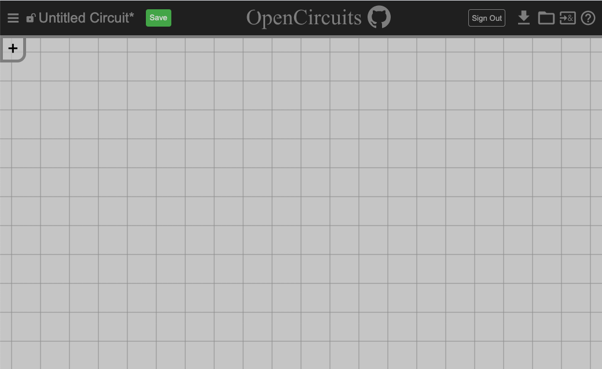
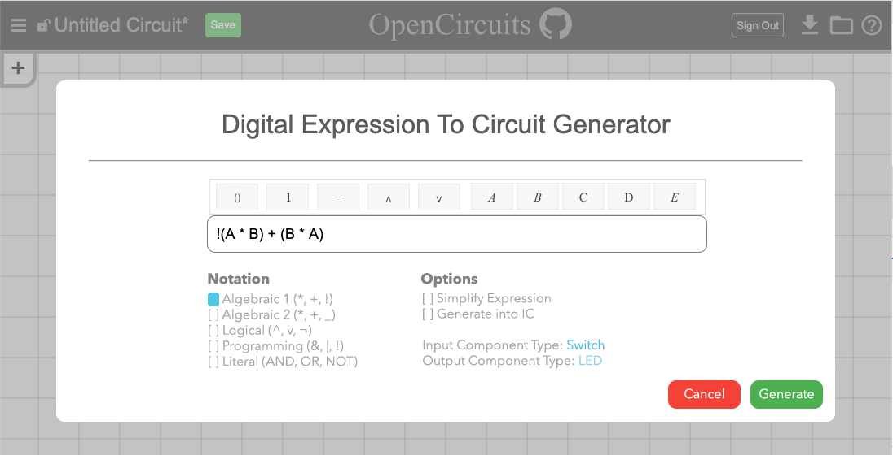

import TOCInline from '@theme/TOCInline';
import Timeline from './_timeline';

---

# *Logical Expression to Circuit* Design Doc
#### *[Trevor Crystal](https://github.com/TGCrystal)*, *[Leon Montealegre](https://github.com/LeonMontealegre)* (Last updated *December 11, 2020*)

    

        Table of Contents
    

    <TOCInline toc={toc} />

## Overview

Creating large and complex circuits is time consuming. Most people who want to create and design circuits have a pretty good method of doing so:

1. Create a truth table with how you want your circuit to function
2. Convert the truth table into a logical expression
3. Simplify that logical expression using methods such as Karnaugh Maps and Quine-McCluskey methods
4. Manually turn your simplified logical expression into a circuit using a circuit designer (like OpenCircuits)
5. Create the physical circuit

The goal for this issue is to tackle #4 of the workflow, i.e. allow users to enter a logical expression and automatically generate a circuit without having to build and design it manually.

## Context

While we eventually plan on tackling every part of the workflow, the most time-consuming part is generally building a logical expression into a circuit. So to be able to take an expression and create a circuit from it would massively increase the productivity of the designer.

## Goals & Non-Goals

### Goals:
- Allows users to enter a logical expression and generate a circuit from it
- Also allow the ability to have the user choose to generate the circuit as an IC

### Non-Goals:
- We do not plan on implementing truth table inputs for this issue
- We also do not plan on implementing a logical-simplification algorithm

## Milestones

<Timeline 
    start="10/23/20" 
    milestones={[{
        date: "11/11/20",
        explanation: "Write tests for and then design the algorithm that takes in a logical expression and produces a circuit",
    }, {
        date: "12/4/20",
        explanation: "Create the menu button/popup for inputting the logical expression, implement algorithm to place the circuit nicely on the canvas",
    }, {
        date: "12/11/20",
        explanation: "Test additional edge cases and fix bugs",
    }]} 
    end="12/11/20" />

## Existing Solution

Currently, it is possible to take any sort of logical expression and manually build an equivalent circuit. However, this is usually very time-consuming and can be extremely tedious.

Current User Walk-Through:
1. A user decides on a logical expression they want to turn into a circuit
2. They open the item nav and begin placing components
3. They manually wire up all of the components
4. They spend time testing the circuit to make sure it works
5. They spend time debugging since they ended up making a few mistakes
6. They spend time organizing the circuit so that it is visually appealing
7. They again spend time testing the circuit to make sure it works

## Proposed Solution

Proposed User Walk-Through:

1. A user decides on a logical expression they want to turn into a circuit
2. The user opens the circuit generation menu
3. The user enter their logical expression into the field
4. The user decides how they want their circuit generated (i.e. as an IC, as a circuit . with switches or buttons as inputs)
5. The user confirms the generation and the circuit is pasted onto the circuit canvas

As can be seen by the walk-through, this is a much simpler and straightforward approach, that only involves a few button presses in contrast to the complicated process of manually building a circuit that is currently required.

## Alternative Solutions

While we can always add many user-friendly enhancements to the circuit designer itself, there will always be user error in manually constructing a circuit, so this feature, while not required to make a fully-functioning circuit, is going to be incredibly helpful.

## Testability

Many unit tests will need to be written for the main algorithm that takes in an expression and generates the circuit. All edge cases will need to be considered. Edge cases include proper precedence for the operators and correct evaluation of parenthesized operations.
The core will simply output a circuit that should be easy to write unit tests for.

## Impact

This feature should have no back-end requirements and will not contribute to potential user-information vulnerabilities.

The input of the logical expression is going to be the feature with the most potential for danger, it however, won't send any requests to the backend so no real sanitization will be necessary. 

Large logical expressions could have some serious performance drawbacks. This needs to be considered and the algorithm designed efficiently. There might also be the necessity of some sort of loading indicator while the circuit is being generated. Along with this, we might also want to warn the user of large circuits and ask if they would rather have the circuit put into an IC (which has considerably better performance when placed).

## Known Unknowns

- We are unsure exactly how we want the user to input the logical expression (although the mockup in Milestone 2 looks promising)
- Also unsure of where the menu for generating the circuit should be or how it should look in general (idea 1 for section 1 of Milestone 2 looks best, allows for expansibility to things like truth table)
- How will invalid inputs be handled? (at core algorithm level, null will be returned)
- Where on the canvas will the new circuit be placed, particularly if there is already another circuit? (may not really matter if the circuit is selectable once being placed)

## Detailed Scoping

### Milestone 1

1. The main algorithm will be designed using a combination of my knowledge of LL parsing from the Programming Languages class and this article: https://www.meziantou.net/creating-a-parser-for-boolean-expressions.htm
2. Operator precedence (following javascript precedence rules, maybe a later feature can allow custom precedence)
    1. ()
    2. !
    3. &
    4. ^ (xor)
    5. |
    6. This means & is evaluated before | so “a & b | c & d == (a & b) | (c & d)”
3. Context-free grammar (boolean expressions are normally evaluated as left-associative, but since we are just building a circuit to represent the expression it should work as right associative)
    1. `Expr -> OrExpr`
    2. `OrExpr -> XorExpr ‘|’ OrExpr | XorExpr`
    3. `XorExpr -> AndExpr ‘^’ XorExpr | AndExpr`
    4. `AndExpr -> NotExpr ‘&’ AndExpr | NotExpr`
    5. `NotExpr -> ‘!’ ParenExpr | ParenExpr | ‘!’ NotExpr`
    6. `ParenExpr -> ‘(’ Expr ‘)’ | input`
4. Core function prototype
    1. Parameters:
        1. `inputs`: links the names of inputs to a reference to the input that will be used, the final circuit will use the same DigitalComponent objects passed in here
        2. `expression`: the expression to be parsed (caller should standardize the notation before calling, use & | ^ ! style operations)
        3. `output`: type of output to send to (LED, etc.)
            1. Will default to input port 0 of the item, the item will also be passed by reference for easy testing
    2. Returns:
        1. The circuit generated by the algorithm will be returned, the caller will have to change the positioning of the components to look nice
        2. Return `null` if there is any errors are encountered
    3. `function ExpressionToCircuit(inputs: Map<string,DigitalComponent>, expression: string, output: DigitalComponent): DigitalObjectSet`
5. Pseudocode:
    1. `function GenerateTokens(input: string): Array<string>`
        1. Create `Array<string> tokenList` and `string buffer`, whenever `buffer` is added to `tokenList` remove `buffer`
        2. Iterate over `input` char by char, do the following based on the char:
            1. ` ` then if there is something in `buffer`, add it to `tokenList`, otherwise continue
            2. `(` or `)` if anything is in `buffer`, add it, then add the current char either way
            3. `&` or `|` or `^` then if there is something in `buffer`, add that to `tokenList`, then add the current char either way
        3. Return `tokenList`
    2. Referring to cfg in section 3 of this milestone, each rule a-f will be a function, and they will function similar to the following examples for `XorExpr` and `ParenExpr`:
    3. `function ParseXorExpr(tokens: Array<string>, int index, inputs: Map<string, DigitalComponent>): DigitalObjectSet, int`
        1. `leftCircuit, index = ParseAndExpr(tokens, index, inputs)`
        2. `if(index >= tokens.array || tokens[index] != ‘^’) return leftCircuit, index`
        3. `index++`
        4. `rightCircuit, newIndex = ParseXorExpr(tokens, index, inputs)`
        5. `connected = leftCircuit and rightCircuit with Xor gate connecting`
        6. `return connected, newIndex+1`
    4. `function parenExpr(tokens:  Array<string>, int index, inputs: Map<string, DigitalComponent>): DigitalObjectSet, int`
        1. `if(tokens[index]==’(‘)`
            1. `circuit, index = ParseExpr(tokens, index+1, inputs)`
            2. `assert(tokens[index]==’)’)`
            3. `return circuit, index+1`
        2. `return inputs[tokens[index]], index+1`
    5. `function ExpressionToCircuit(inputs: Map<string, string>, expression: string,  output: DigitalComponent): DigitalObjectSet`
        1. `tokens = GenerateTokens(string)`
        2. `circuit = ParseExpr(tokens, 0, inputs)`
        3. `return(add output to end of circuit)`
    6. Use prototype to design tests, pseudocode to create algorithm

### Milestone 2

1. Implement the menu button
    1. Idea 1: (leaning towards this one currently, allows for more expansion)
    
    2. Idea 2:
    

2. Implement the popup for the logical expression input

3. Rearrange the circuit so that it actually looks good on the canvas. Pseudocode:
4. `placeCircuit(circuit: DigitalObjectSet)`
    1. Create `Array<[int,component]> components`
    2. Create `map<component, int> indices`
    3. For `input` in `circuit.inputs`
        1. `components.push([0,input])`
    4. While `components.length > 0`
        1. `index, comp = components.shift`
        2. `indices[comp] = max(indices[comp], index)`
        3. For `component` in output of `comp`
            1. `components.push([index,comp])`
    5. Iterate over the circuit, placing and connecting components so that each component is in column `indices[component]`

### Milestone 3

1. Test the UI, perform tests on generating when there is already a circuit in place, etc.
2. Lots of tests will need to be done to make sure the components of the circuit are placed in a visually comprehensible way (not all piled on top of eachother). This kind of testing can’t easily be automated.

