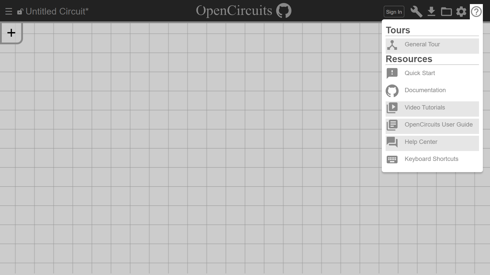
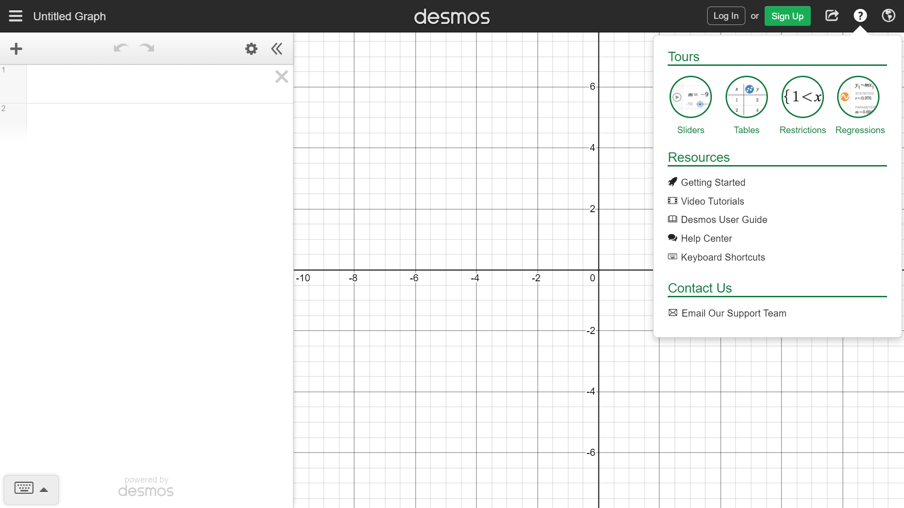

import TOCInline from '@theme/TOCInline';
import Timeline from './_timeline';


---


<div style={{height: "80px", width: "100%"}}>

</div>


# *General Tour* Design Doc
#### *[Trevor Crystal](https://github.com/TGCrystal)*, *[Harshita Garg](https://github.com/mercuryhg31)* (Last updated *02/12/2022*)


<details>
    <summary>
        Table of Contents
    </summary>
    <TOCInline toc={toc} />
</details>


## Overview

The goal of this feature is to create a tour that shows new users how to use OpenCircuits. This includes things like placing and connecting components.


## Context

New users may not immediately see the itemnav to open to place components. Also, some more useful yet advanced features like creating ICs may be hard to find for users. The implementation will allow these features and more (with extensibility for more new features implemented in the future as well).


## Goals & Non-Goals

### Goals:
- Define a json (or other format) that allows for easy specification of a tutorial
- When the user loads the page for the first time, it should display a basic tutorial for creating/connecting Switches to ANDGate to LED
- End of initial tutorial should show location in UI where other tutorials can be started (and the initial one can be redone)

### Non-Goals:
- This is not creating any sort of separate page like issues #369, #370, or #371, it is all part of the circuit designer


## Milestones

<Timeline 
    start="Start Date" 
    milestones={[{
        date: "02/16/21",
        explanation: "Create JSON file for General Tour"
    }, {
        date: "03/16/21",
        explanation: "Implement programming for realizing the tour onto the site"
    }, {
        date: "Indefinite",
        explanation: "Add more tours and clean up current menu for Tours"
    }]} 
    end="End Date" />


## Existing Solution

Have someone already familiar with OpenCircuits teach you or figure it out on your own.


## Proposed Solution

First time users will be given a walkthrough of how to use OpenCircuits. The item nav would be highlighted, and then the components required to drag onto the campus would also be 


## Alternative Solutions

Video tutorials could work, but showing the user how to use the program in an interactive way is far more intuitive and useful.


## Testability

Currently, frontend testing does not exist so there is little that can be tested. There could possibly be some sort testing of a parser to help process the json file input, but the exact method of converting to json to actual tutorial has yet to be determined, so testability is not yet fully determined.


## Impact

There should be a single button that can be used to exit the tutorial at any point. 


## Known Unknowns

Basically all implementation details are still unknown.


## Detailed Scoping


### Milestone 1

1. Create JSON file structure for defining tutorials.
    1. ``` json
        {
            "name": "Name of Tutorial (General Tour, etc)",
            "intro": {
                "title": "Title ('Welcome to OpenCircuits!')",
                "body": "[welcome message]",
                "button": {
                    "title": "Button Text Content ('Next')",
                    "action": "Name of the next step this button will take the user to"
                }
            },
            "step_1": {
                "body": "Body text ('Click on this button to open the Item Nav... etc')",
                "location": "item that the text box should be pointing towards (think Desmos tour design)",
                "side": "top/left/bottom/right (direction from which the arrow should be pointing)",
                "button": {
                    "title": "Prev",
                    "action": "intro"
                },
                "button": {
                    "title": "Next",
                    "action": "step_2"
                }
            },
            "step_2": {
                ...
            }
        }
        ```
    2. Consider how much should be specified in the JSON file and how much should be decided in whatever interprets the file data.
        1. Does the direction from which the box points at the indicated feature on the site be determined in the JSON file? this probably changes depending on what device is being used so perhaps this would be handeled programmatically.
        2. Is there a need to define which steps the next button will take the user to? To even define the button in here? Can we consider that by default we will insert prev and next buttons that will automatically make one progress through the tutorial? (similar to how there will by default be an 'X' button to close out of the tutorial at all times)
2. Create actual files containing the information for the tour.
    1. For the general tour it'd just be `general_tour.json`, but we can plan out other tours for specific features such as the expression to circuit generator, creating and snipping wire nodes, smart place, etc etc.
    2. As stated before, the tour would just be a simple walkthrough of placing two Switchs, an AND Gate, and an LED and connecting them.


### Milestone 2

1. Implement code for translating JSON files to actual tour on site.
    1. ???
    2. Looking into using Shepherd.js


### Milestone 3

1. Begin creating other menus for specific features.
1. Implement menu to be able to revisit all available tours.
    1. Option 1: We already have this as a place holder on the site:  
    
    2. Option 2: This isn't very different, but I rather like Desmos's take on it, it's slightly easier on the eyes.  
    
2. It might be a good idea to enforce the general tour showing where to access the tours menu if the user just closes the tour without going through it. It would also do this at the end of the tour if the user reaches the end without closing it.

