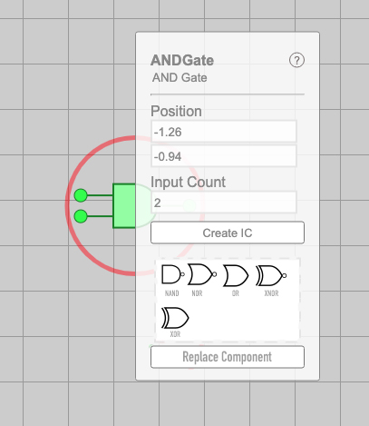

import TOCInline from '@theme/TOCInline';
import Timeline from './_timeline';

---

# *Replace Component* Design Doc
#### *[Trevor Crystal](https://github.com/TGCrystal)*, *[Leon Montealegre](https://github.com/LeonMontealegre)* (Last updated *June 19, 2022*)

    

        Table of Contents
    

    <TOCInline toc={toc} />

## Overview

The goal is to create a way to replace a component with another (compatible) component. For example, an ANDGate placed in the circuit and connected could be replaced with an ORGate. That new ORGate will have all of the connections that the ANDGate had. This will be performed as an Action so that it is reversible. This will be accessed by a button in the SelectionPopup.

## Context

Creating a large circuit just to realize that you accidentally used the wrong gate somewhere in the middle can be annoying, especially if the gate has many wires connected to it's output or has more than the standard two input ports. With this, every connection would not have to be remade.

## Goals & Non-Goals

### Goals:
- The initiation for this action will be a button in the SelectionPopup.
- Examples of possible replacements include:
- ORGate for a NANDGate
- ANDGate with no inputs for a Switch
- XORGate with one input for a NOTGate
- Switch for an XORGate with only outputs
- Multiplexer for ANDGate with six inputs
- IC with four inputs and two outputs for an encoder

### Non-Goals:
- Another way would be to allow the user to drag and drop a component onto another one to replace it. This is another good way to implement it, but for the initial pull request will be considered outside of the scope.

## Milestones

<Timeline 
    start="11/20/2021" 
    milestones={[{
        date: "11/22/21",
        explanation: "Adds lots of tests for current ReplaceComponent action",
    }, {
        date: "11/23/21",
        explanation: "Add/Test function to check if one DigitalComponent can replace another",
    }, {
        date: "11/29/21",
        explanation: "Implement UI to connect everything together",
    }]} 
    end="11/29/2021" />

## Existing Solution

The current way to do this is to delete the component, place the new component, and recreate every connection.

## Proposed Solution

There is a ReplaceComponent action implemented with the expression parser, that can be used to perform the actual replacement. To the user, this will be accessible through a popup that appears from a button in the SelectionParser.

## Alternative Solutions

- The replacement by the user could also be done by dragging and dropping a suitable replacement. This has the UI challenge of showing the user that a replacement is happening. This should be considered a future feature to implement.

## Testability

The core replacement algorithm will be testable. A function that checks if one component can replace another can also be testable.

## Impact

There shouldn't be any side effects from this.

## Known Unknowns

- Some edge cases of what can/can't be replaced are unknown. For example, should a NOTGate be able to replace a SR Latch with one input/output?

## Detailed Scoping

There is an action for replacing a component already implemented. It currently throws an error if the new component does not have the same number ports, so that would have to modified to an error if the replacement does not have the same number as the number of ports in use. That action is in the core so is ignorant to the difference between input and output ports. That is where the funciton in Milestone 2 will come into play in order. It will function similar to the check in the core replacement action, but with input and output ports. It will return a boolean for whether or not the proposed component is a suitable replacement. When the popup is loaded, it can check every kind of Component available in OpenCircuits to see if the selected Component can be replaced by it.

### Milestone 1

Add more tests.

### Milestone 2

The function will check the number of output/input ports in use vs. the number that the component to replace could use. For example, an ANDGate would obviously be able to replace an ORGate with three inputs.

### Milestone 3

Using a Popup would likely be the easiest way to do this. Flexbox can be used to display the items and they can be grouped like they are grouped in the itemnav.

There are a few ways to go about the UI, but the presented ideas are as follows:

1. An area within the SelectionPopup directly that has a visual list of all the components that are able to replace the currently selected ones. The user could then click on one and press the "Replace Component" button to replace it. Potentially it could even "temporarily" replace as the user clicks on them and does a permanent replace when the button is pressed.

2. The alternative idea would have the same display but in a larger popup that shows up when the "Replace Component" button is pressed. This may be better on mobile or smaller screens since (1) may be too cluttered or small to see/press.

Note: that for multiple components, the replace components feature should only show up if all the components have the exact same number of ports and can be replaced by the same things.